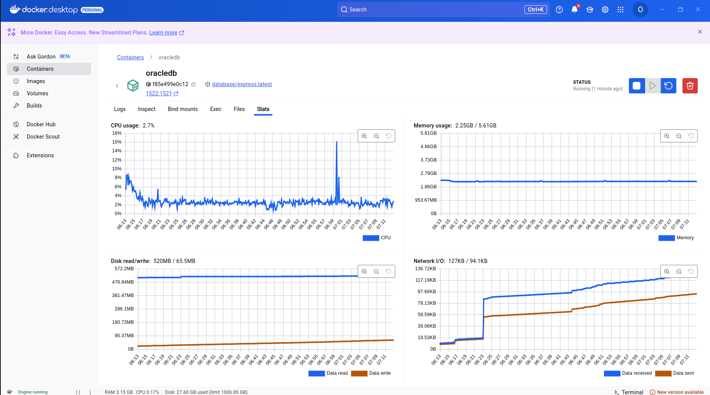

**Advanced Query Examples**

<h1>ntile() example:</h1>
<h2>Answers the question: Give me the first descending bucket of a 4 bucket distribution of total sales by customer for 2025</h2>
<pre>
  <code>
  select r.region_name, cust.CUSTOMER_NAME, quart.customer_sales
  from ( select region_no, customer_no, sum(tot_sales) customer_sales,
       ntile(4) over (order by sum(tot_sales) desc) sales_quartile
       from JWICK.ONYX_ORDERS
       where TO_CHAR(ORDER_DATE,'YYYY') = '2025'
       group by region_no, customer_no) quart inner join JWICK.ONYX_CUSTOMERS cust
       on quart.customer_no = cust.customer_no
       inner join JWICK.ONYX_REGIONS r
       on quart.region_no = r.region_no
       where quart.sales_quartile = 1
       order by quart.customer_sales desc;
  </code>
</pre>

<h1>Trace file on OracleDB Docker Container</h1>

<h1>Monitor within local running Docker Hub</h1>

